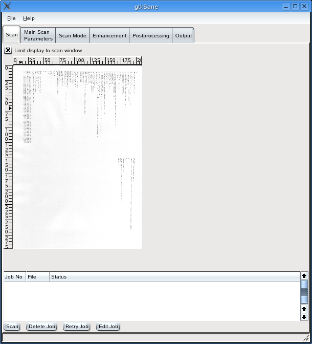
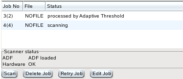
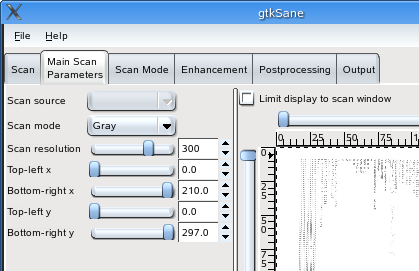
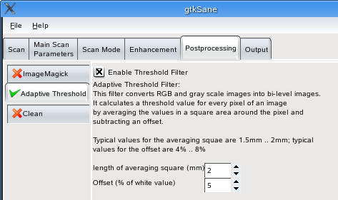

+------------------------------------+-------------------------------+------------------------------------+
| `prev: Introduction <intro.html>`_ | `up: Contents <index.html>`_  | `next: Scan Jobs <scanjobs.html>`_ |
+------------------------------------+-------------------------------+------------------------------------+

======================================================================
User Interface
======================================================================

Sane backends provide numerous user settable 
options, which differ from backend to backend and from scanner model to 
scanner model. Accordingly, a frontend like Eikazo must be able
to present all these different options. This means that the screenshots
shown here are most likely not identical to what you see for your
scanner. The screenshots are taken from Eikazo controlling either
a Sharp JX-250 or a Fujitsu fi-5120 and sometimes from Sane's test backend.

   Eikazo window for a Sharp JX-250. The tabs Scan Mode and Enhancement
   are specific for the scanner.

Eikazo's user interface is divided into tabs; the general idea is that
you begin with the tab "Main Scan Parameters" (this tab is available
for all scanners), set options there, go to the next tab to the right, 
set the options there, until you reach the rightmost tab. Then you go back
to the leftmost tab and click on "scan".

The leftmost tab as shown above displays an image of the last scan
and a table of currently active "scan jobs". This table may contain
more than one entry, if a docment feeder is used, because a new scan
is started immediately after the last scan is finished, but before it
is completely processed and stored or printed:

   job status table and scanner status for a Fujitsu fi-5210

As you can also see in the screenshot above, some additional information
about the scanner's status may be shown. It is provided
by a device plugin, i.e., it is not available for all scanners and Sane 
backends.

Tab: Main Scan Parameters
=========================

In this tab you can set the most important parameters for a scan: 
The scan source (typical options are flatbed, ADF or transparency adapter),
the scan mode (color, gray scale or lineart scan), the resolution of
the scan and size and position of the scan window. Some ADF scanners 
allow also to set the width and height of a page; controls for these 
parameters are also displayed in this tab. A device plugin can add additional 
options.

   
   main scan parameters tag for a typical flatbed scanner (Sharp JX-250)

Scanner specific tabs
===========================

\.\.. like "Scan Mode", "Enhancement" as shown in the screenshot near
the top of this page are not explained here, because they differ from 
scanner model to scanner model. Most options can show a tooltip help 
(if provided by the backend); you may find more information about the 
backend and its options in the backend documentation.

Tab: Postprocessing
===================

This tab allows to set options to enhance or modify the scanned image.

It has at present three sub-tabs, representing three image filters: 
ImageMagick, Adaptive Threshold and Clean. You can enable and disable
each of the filters by clicking the checkbox in the top-left corner
of the tabs. For details about the plugins, see 
`postprocessing <postproc.html>`_.

   the postprocessing tab

Tab: Output
===========

Like the postprocessing tabs, the output tab has sub-tabs. Currently it 
provides the option to save scanned images to files and to print the
images. See `output <output.html>`_ for details.
