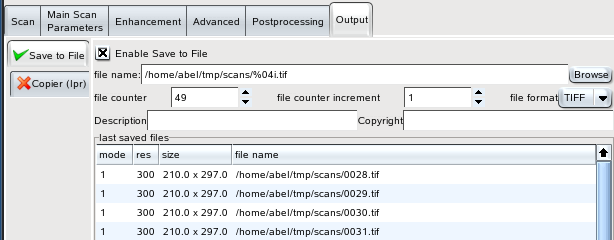

+-----------------------------------------+-------------------------------+-------------------------------------+
| `prev: Postprocessing <postproc.html>`_ | `up: Contents <index.html>`_  | `next: Copyright <copyright.html>`_ |
+-----------------------------------------+-------------------------------+-------------------------------------+

======================================================================
Output
======================================================================

Eikazo has at present two output options: 

- `Save to File`_
- `Copier`_ (print the scan)

Both output options can independently be enabled and disabled, i.e.,
you can save the same scan to a file and print it.

If both outputs are disabled, you get roughly the same as the preview in 
other Sane frontends: the scanned image is only displayed in a window
on the monitor.

Save to File
============

You can select the destination directory and the filename by either
typing the path directly into the field "filename", or you can click
the "Browse" button to select the destination directory with the
usual graphical file selection dialog.

   output tab for "Save to File", TIFF format selected

Filenames should contain a "format expression", allowing the program
to insert a number. In the screenshot above, this is '%04i', meaning
that a four-digit number will be used; if the file number is less 
than 1000, leading zeroes will be inserted. 

If you want to insert a single literal '%' symbol in the filename,
type two ('%%') into the field.

Technically, the value of the field filename is used as a Python 
format string; you can use any format expression that is applicable
to integers. 

The value of "file increment" is added to the file number, when a 
file has been saved. This value may (as well as the filecounter itself)
be negative.

File Format options
-------------------

At present, Eikazo allows to save the image in a TIFF file and in a
JPEG file. For TIFF files, you can additionally define the TIFF fields
"copyright" and "description".

For JPEG files, you can specify the quality of the image.

Copier
======

The copier sends the scanned image as Postscript data to a printer.

You can select the usual parameters like page size, page margins etc.

   output tab for "Copier"

For the selection of the printer, Eikazo does not use a 
GUI dialog. The library libgnomeprint, which prives such a dialog,
has unfortunaetly at present a few problems which make it unusable
for Eikazo.

Instead, you must specify a command line program in the field 
"print command". The postscript data is passed as stdin to this program.

The default program is lpr, which is available on most Unix/Linux systems.

lpr sends the print data to the default print queue; if you want to use another
one, add the -P option, like ``lpr -P specialPrinter``. For more options or
other command line print programs like ``lp``, please refer to their man
pages.
