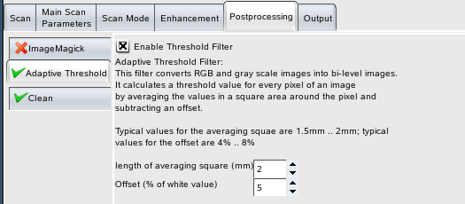
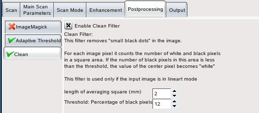
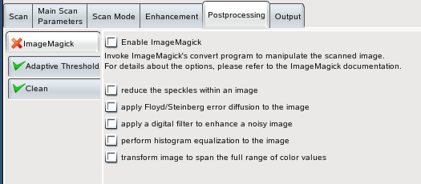

+------------------------------------+-------------------------------+-------------------------------+
| `prev: Scan Jobs <scanjobs.html>`_ | `up: Contents <index.html>`_  | `next: Output <output.html>`_ |
+------------------------------------+-------------------------------+-------------------------------+

======================================================================
Postprocessing
======================================================================

At present, Eikazo provides three postprocessing options:

- `Adaptive Threshold`_ filter
- Clean_ filter
- ImageMagick_ filter

All filter options can independently be enabled and disabled; they are 
invoked in the same sequence as they are displayed in the postprocessing 
tab.

Some filters do not process all image types; the adaptive threshold 
filter for example works only on gray scale images. If 
an unsupported image type is fed to such a filter, it returns the
image unchanged.

Adaptive Threshold
======================

This filter converts gray scale images into lineart images. For each
pixel of the input image, it calculates the average value of the pixels
in a square area around this pixel. The threshold value for the center pixel
is this average minus an offset value. This allows reliable thresholding 
even for documents with considerable changes of the background color. 

   Adaptive Threshold tab

A drawback of the filter: If you have dark areas that are larger than
the averaging square, it can happen that only the edges of the area
will stay dark, and that the "inner part" of such an area will become 
white. This occurs, if the offset value is too small. In this case you 
can either increase the averaging square or increase the threshold value.

The runtime of the algorithm is proportional to O(n), where n is the 
length of the averaging square, i.e., it is much faster for larger
squares than a universal convolution filter, whose runtime is often O(n*n). 

Clean
========

This filter works only on lineart images.

For a "noisy" image, thresholding can lead to many small speckles
in the image. This can occur both for a simple constant threshold, as well
as for the adaptive threshold. The clean filter counts the number
of black pixels in a square area around each pixel; if this number
is below a selectable threshold, the center pixel becomes a white pixel.

   Adaptive Clean tab

ImageMagick
==============

This plugin simply calls the program "convert" from
ImageMagick. It is mostly intended to be an example, that it is
quite simple to include an external program as a filter for Eikazo.
Including the lengthy copyright notice, the source code consists of only 126 
lines. Its "real" usefulness for daily scan tasks is at least in its
current setup - only "boolean" options are supported - questionable.

Please note that convert may need considerable amounts of memory and may
run for a long time for some filter options.

   ImageMagick tab

