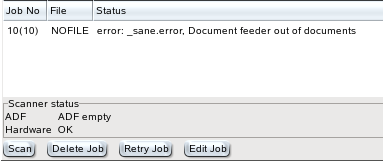

+------------------------------------+-------------------------------+-----------------------------------------+
| `prev: User Interface <gui.html>`_ | `up: Contents <index.html>`_  | `next: Postprocessing <postproc.html>`_ |
+------------------------------------+-------------------------------+-----------------------------------------+

======================================================================
Scan Jobs
======================================================================

The table at the bottom of the "Scan" tab displays information about 
scan jobs, i.e. scans that have been started but not yet finished. 
If a document feeder is used, Eikazo starts a new scan immediately after 
the previous scan is finished, before the latter 
has been completely processed by filters and sent to a printer or stored 
in a file. In this case you may see more than one entry in the job table.

.. figure:: images/gui2.png

   job status table, when two scan jobs are active

Jobs that are active, i.e. that are processed normally without any error,
disappear automatically from the job table
when they have been sent to a printer and/or successfully saved to a file.

If an error occurs, the job remains in the job table, until it is manually 
removed or restarted. 

   error example: A scan could not be started, because the ADF is empty

If a job has an error, you can either delete it or restart it. Click with
the mouse pointer on the line of the job in the table and then click 
the remove or retry button. In the example
above, there is of course no difference between retrying and deleting the
job, because no image has yet been scanned, but the following screenshot 
shows a more complex situaion.

.. figure:: images/err3.png

   error example: disk full

Here, the oldest job could not be saved, but three other scans have been
made meanwhile. (The number of scans that can be started, before Eikazo
stops because an error occured depends on the number of enabled 
postprocessing filters.) When you click on the error job and then click
the delete button, **all four** jobs will be deleted. 

The logic behind this concept is as follows: If only the job having
an error is removed, the other three scan jobs could theoretically
be saved (admittedly, this is not very likely, if the disk if full, but you
can for example change the destination directory). Then you need
to take the fourth page from the top of the stack of scanned
documents, put it back into the document feeder, scan it, and put it
back at its original position in the stack. This makes it very easy to
mess up the stacks of scanned and of unscanned documents.

If all four documents in the example must be scanned again, you can simply
take all of them from the stack of scanned documents, put them back into
the document feeder together with the other unscanned documents and continue,
when you have fixed the error. 

Hence the logic of Eikazo is: If you delete a scan job, all other jobs that
have been started later will also be deleted.

To help you find successfully scanned documents, the output tab provides
a list of the last 20 saved files.
